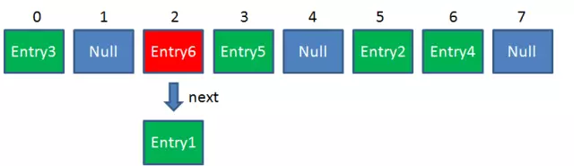
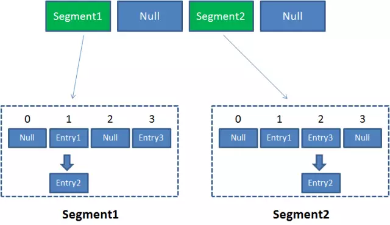

HashMap是一个用于存储Key-Value键值对的集合，每一个键值对也叫做Entry。这些个键值对（Entry）分散存储在一个数组当中，这个数组就是HashMap的主干。
HashMap数组每一个元素的初始值都是Null。

最常使用的是两个方法：Get 和 Put。

index =  Hash（“apple”）

index冲突:
利用链表来解决
HashMap数组的每一个元素不止是一个Entry对象，也是一个链表的头节点。

Put:
新来的Entry节点插入链表时,如果冲突,使用的是“头插法”。

GET:
由于刚才所说的Hash冲突，同一个位置有可能匹配到多个Entry，这时候就需要顺着对应链表的头节点，一个一个向下来查找。假设我们要查找的Key是“apple”：

初始长度16, 每次自动扩展或手动初始化长度必须是2的幂

原因:
index =  HashCode（Key） &  （Length - 1） 

假定HashMap长度是默认的16，计算Length-1的结果为十进制的15，二进制的1111。

Hash算法最终得到的index结果，完全取决于Key的Hashcode值的最后几位。

Resize:
> 衡量HashMap是否进行Resize的条件如下:
> HashMap.Size   >=  Capacity * LoadFactor
> 1.Capacity
> HashMap的当前长度。上一期曾经说过，HashMap的长度是2的幂。
> 2.LoadFactor
> HashMap负载因子，默认值为0.75f

1. 扩容 
创建一个新的Entry空数组，长度是原数组的2倍。 

2. ReHash

hashmap线程不安全：
1. 改用hashtable 和collections.synchronizedmap
性能问题，无论读写都要给集合加锁

ConcurrentHashMap:
ConcurrentHashMap是一个二级哈希表。在一个总的哈希表下面，有若干个子哈希表。

1. 不同Segment的并发写入
2. 同一Segment的一写一读
3. 同一Segment的不能并发写入

Get方法：
1. 为输入的Key做Hash运算，得到hash值。
2. 通过hash值，定位到对应的Segment对象
3. 再次通过hash值，定位到Segment当中数组的具体位置。

Put方法：
1. 为输入的Key做Hash运算，得到hash值。
2. 通过hash值，定位到对应的Segment对象
3. 获取可重入锁
4. 再次通过hash值，定位到Segment当中数组的具体位置。
5. 插入或覆盖HashEntry对象。
6. 释放锁。

ConcurrentHashMap的Size方法是一个嵌套循环，大体逻辑如下：
1. 遍历所有的Segment。
2. 把Segment的元素数量累加起来。
3. 把Segment的修改次数累加起来。
4. 判断所有Segment的总修改次数是否大于上一次的总修改次数。如果大于，说明统计过程中有修改，重新统计，尝试次数+1；如果不是。说明没有修改，统计结束。
5. 如果尝试次数超过阈值，则对每一个Segment加锁，再重新统计。
6. 再次判断所有Segment的总修改次数是否大于上一次的总修改次数。由于已经加锁，次数一定和上次相等。
7. 释放锁，统计结束。

