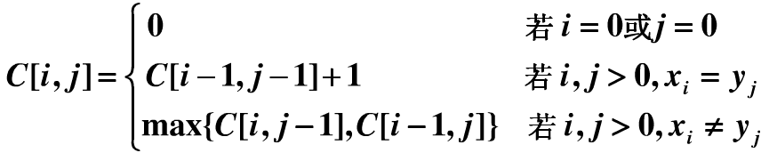

动态规划解决

第一步：先计算最长公共子序列的长度。

第二步：根据长度，然后通过回溯求出最长公共子序列。

现有两个序列X={x1,x2,x3，...xi}，Y={y1,y2,y3，....，yi}，

设一个C[i,j]: 保存Xi与Yj的LCS的长度。

解决输出最长子序列的问题，

我们采用一个标记函数Flag[i,j]，当

1. C[i,j]=C[i-1,j-1]+1  时 标记Flag[i,j]="left_up";    （左上方箭头）

2. C[i-1,j]>=C[i,j-1]   时 标记Flag[i,j]="left";          （左箭头）

3. C[i-1,j]<C[i,j-1]     时 标记Flag[i,j]="up";            （上箭头）
